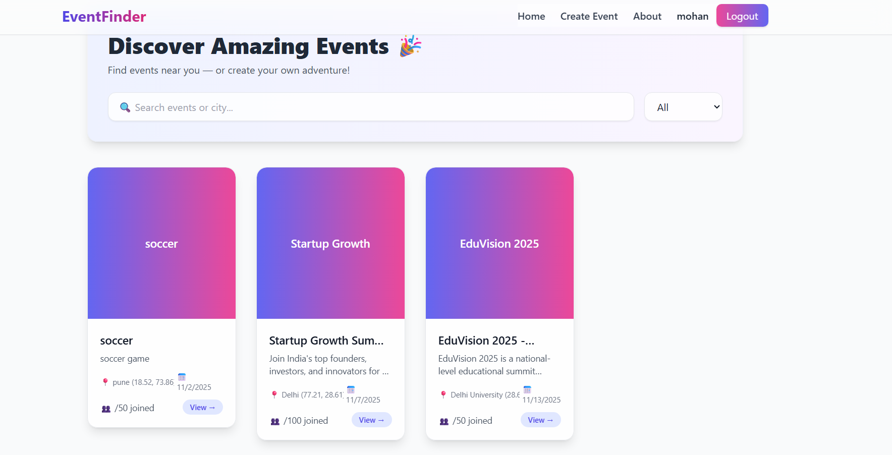
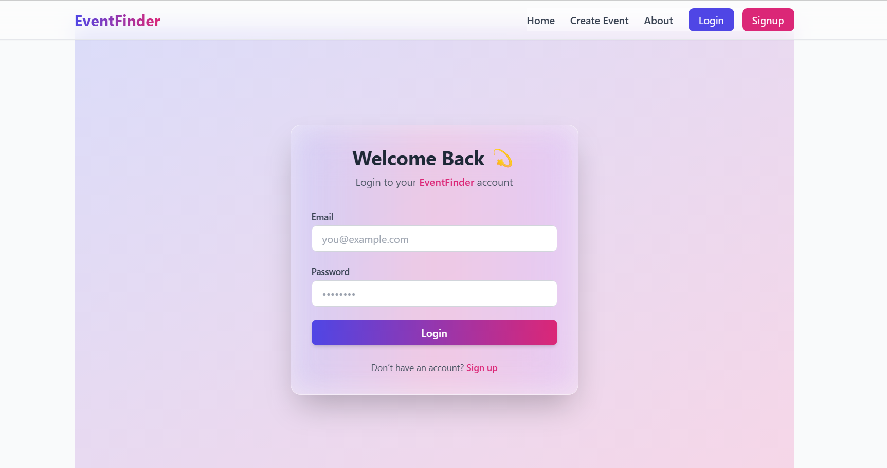
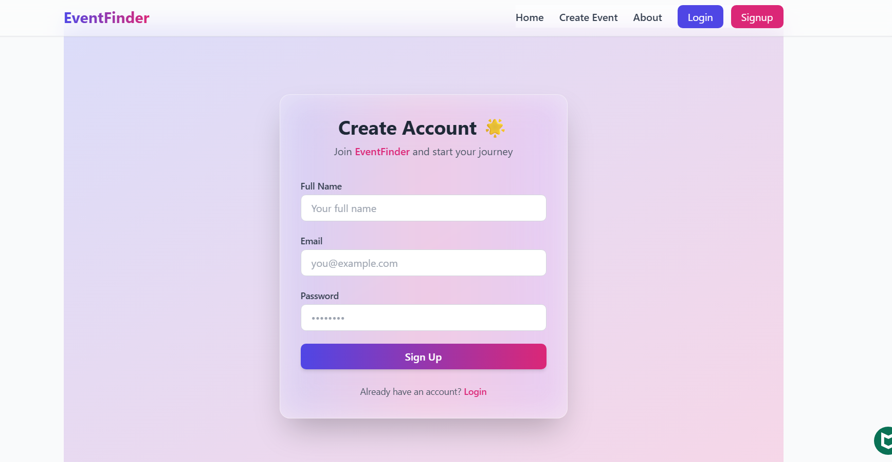
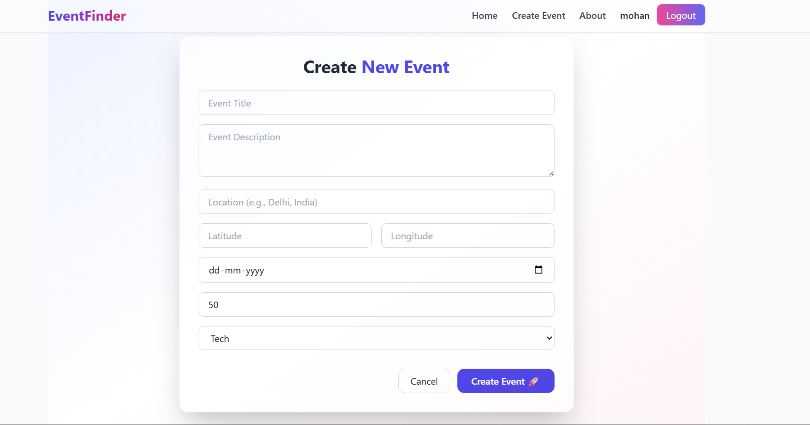

# 🌍 ✨ Event Finder — Discover • Connect • Create ✨

### Explore Events • Build Networks • Inspire Minds

> A modern full-stack *MERN + TypeScript* application that lets users discover, create, and manage educational events with an elegant responsive interface and secure authentication.

🌐 *Live Site:* [event-finder-six-fawn.vercel.app](https://event-finder-six-fawn.vercel.app)  
⚙ *Backend API:* [event-finder-6.onrender.com](https://event-finder-6.onrender.com)  
📦 *GitHub Repo:* [codergautam900/Event-Finder](https://github.com/codergautam900/Event-Finder)

---

## 🏗 Architecture Overview

text
Frontend (React + TypeScript + Tailwind)
        ⬇ Axios REST Calls
Backend (Node.js + Express.js)
        ⬇ Mongoose ORM
Database (MongoDB Atlas)

---

🏷 Tech Stack

Category	Tools Used

🖥 Frontend	React + TypeScript · Tailwind CSS · React Router · React Toastify
⚙ Backend	Node.js · Express.js
🗄 Database	MongoDB + Mongoose
🔐 Authentication	JWT (JSON Web Token)
☁ Hosting	Vercel + Render

---

🧠 Overview

Event Finder helps students and professionals explore and host educational or career-oriented events.
Users can browse, create, or manage events with ease — powered by a clean UI, fast backend, and secure token-based authentication 🔒.

---

✨ Features

👥 User Features

🔐 JWT-secured login & registration

🧭 Explore events by category

📍 Add events with latitude & longitude for real locations

📱 Fully responsive design

💬 Toast notifications for smooth feedback

🧑‍💻 Creator / Admin Features

🆕 Create new events

✏ Update or delete existing events

📊 Manage event list in dashboard

🌍 Geolocation ready with coordinates

---

### 🖼 Screenshots

| Home |
|------|--------|-----------|
|  | 

| Login | Signup | Create-event |
|--------|-----------|-------------|
|  |  |  |  

> 📸 Place your screenshots in /assets and rename as per your UI pages.

---
			

> 📸 Replace these placeholder screenshots in /assets with your own UI captures.

---

⚙ Installation Guide

🧩 Step 1 — Clone the Repository

git clone https://github.com/codergautam900/Event-Finder.git

🧩 Step 2 — Install Dependencies

cd Event-Finder
cd client && npm install
cd ../server && npm install

🧩 Step 3 — Setup Environment Variables

Create .env file inside /server folder:

PORT=5000
MONGO_URI=your_mongodb_uri
JWT_SECRET=your_secret_key
FRONTEND_URL=https://event-finder-six-fawn.vercel.app

🧩 Step 4 — Run the App

Backend

npm run dev

Frontend

npm run dev

App runs locally at 👉 http://localhost:5173

---

🔐 API Endpoints

Method	Endpoint	Description

POST	/api/auth/signup	Register a new user
POST	/api/auth/login	User login
GET	/api/events	Fetch all events
POST	/api/events	Create new event
PUT	/api/events/:id	Update existing event
DELETE	/api/events/:id	Delete event

---

💎 Folder Structure

Event-Finder/
├── client/
│   ├── src/
│   │   ├── components/
│   │   ├── pages/
│   │   └── App.tsx
│   └── package.json
│
├── server/
│   ├── controllers/
│   ├── models/
│   ├── routes/
│   ├── utils/
│   ├── server.ts
│   └── .env
│
└── README.md

---

🚀 Deployment

Service	Purpose

🖥 Vercel	Frontend Hosting
⚙ Render	Backend Deployment
☁ MongoDB Atlas	Cloud Database

---

🌱 Future Enhancements

📍 Google Maps event integration

💬 Discussion & chat per event

🧭 Category-wise filtering and search

🌙 Dark / Light theme toggle

🔔 Email notifications for registered events

---

🧑‍💻 Developer Info

👤 Gautam Sagar
📧 Email: gateaspirant8650@gmail.com
📞 Phone: +91 7900503595
💻 GitHub: codergautam900
🌍 Portfolio: Coming Soon 🚀

---

💫 “Great connections start with great events — Event Finder makes it effortless!”

⭐ If you liked this project, give it a Star ⭐ — it truly helps me grow!

---

  
  
  
  
  
  

---